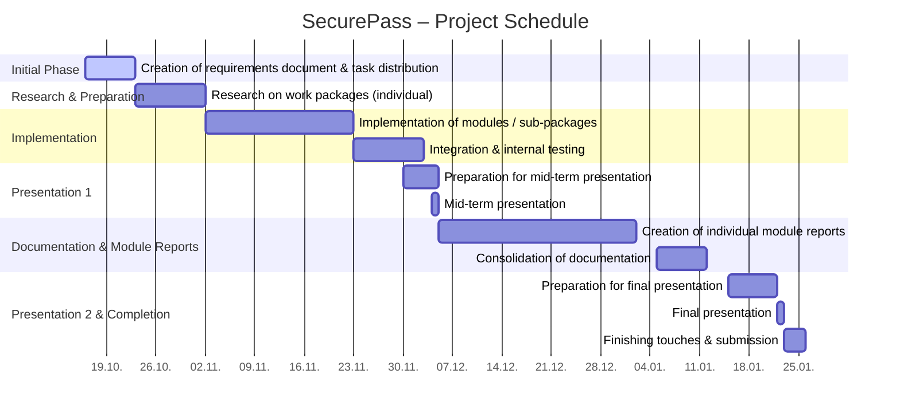

# Project Diary – **SecurePass**

---

**Start date:** October 16, 2025 
**Planned end:** January 22, 2026 
**Responsible for updates:** All team members (weekly)

---

## Preliminary Timeline

---

## 1. Progress and Findings (Plan vs. Reality)

### Weeks 1–2: October 16 – 29, 2025  
*(Creation of the requirements document, role distribution, setup of repositories and development environment, and start of individual research on each work package.)*

### Weeks 3–4: October 30 – November 12, 2025  
*(Research and design of the first prototypes for individual components, coordination between modules.)*

### Weeks 5–6: November 13 – 26, 2025  
*(Start of implementation of each module, ensuring compatibility, and establishing the internal testing workflow.)*

### Weeks 7–8: November 27 – December 10, 2025 *(Mid-term presentation)*  
*(Finalizing first implementation, preparing presentation slides, and presenting the mid-term results.)*

### Weeks 9–10: December 11 – 24, 2025  
*(Bug fixing, improving the codebase, and beginning to write the module documentation and individual reports.)*

### Weeks 11–12: December 25, 2025 – January 7, 2026  
*(Merging and aligning all parts of the documentation, refining features, and collecting feedback.)*

### Weeks 13–14: January 8 – 22, 2026 *(Final presentation)*  
*(Preparation for final presentation, last adjustments, quality review, and final submission.)*

---