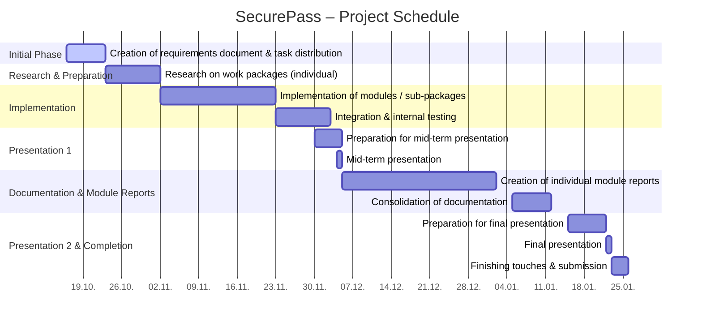

# Project Diary – **SecurePass**

---

**Start date:** October 16, 2025 
**Planned end:** January 22, 2026 
**Responsible for updates:** All team members (weekly)

---

## Preliminary Timeline

---

## 1. Progress and Findings (Plan vs. Reality)

### Weeks 1–2: October 16 – 29, 2025  
*(Creation of the requirements document, role distribution, setup of repositories and development environment, and start of individual research on each work package.)*

In the first project phase, we focused on defining the **scope and foundation** of *SecurePass*.
The goal was to clearly describe the use case, define the technical requirements in the **Requirements Specification (Pflichtenheft)**, and set up a common technical and organizational base for the team.
This included task distribution, creating a shared Git repository, and preparing a clean documentation structure for future development.

* **Requirements Specification (Pflichtenheft)**

    * **Responsible:** *All members*

    The group collaborated on defining the functional and non-functional requirements of the SecurePass system.
    This includes:

    - Describing the system’s purpose (USB data transfer via virtualized sandbox environment)
    - Defining the workflow (automatic scan, VM isolation, safe re-import)
    - Establishing minimum deliverables (working CLI, scan report, mounting process)

    The Requirements Specification draft is managed collaboratively in the project repository under `docs/Requirements_Specifications.md`.

* **VM / Security Environment Setup**

    * **Responsible:** *Linus Rode*

    Initial research and configuration of a suitable virtual environment began.
    The focus was on exploring **Kali Linux** and **QEMU/KVM** setups to provide isolation for scanning operations.
    A first test VM was created to confirm compatibility with USB passthrough and automation.

* **Virtual USB & CLI Planning**

    * **Responsible:** *Paul Ilitz*

    The first concepts for the **virtual USB stick** and **CLI workflow** were developed.
    Paul explored how to create and mount virtual drives dynamically and defined the interface between CLI commands and the VM startup process.

* **Virus Scan Architecture**

    * **Responsible:** *Constantin Scheryer*

    Research began into possible scanning tools and frameworks.
    The focus was on lightweight and scriptable options such as **ClamAV**, along with ideas for an **“ampel” (traffic-light)** scoring system to visually indicate scan results.

* **USB Pass-Through (Host → VM)**

    * **Responsible:** *Tizian Everke & Richard Kats*

    Investigation started into identifying USB devices on the host before enumeration to prevent malicious device behavior.
    First notes were collected on how **VirtualBox USB filters** or **udev rules** might be used to safely forward the device into the VM.

* **GUI Concept**

    * **Responsible:** *Aaron Debebe*

    A simple draft for the **graphical interface** was created, focusing on user feedback and automation flow:

    - Automatic display of scanning progress
    - Traffic-light visualization for results
    - Safe mounting button after successful scan

---

### Weeks 3–4: October 30 – November 12, 2025  
*(Research and design of the first prototypes for individual components, coordination between modules.)*

---

### Weeks 5–6: November 13 – 26, 2025  
*(Start of implementation of each module, ensuring compatibility, and establishing the internal testing workflow.)*

---

### Weeks 7–8: November 27 – December 10, 2025 *(Mid-term presentation)*  
*(Finalizing first implementation, preparing presentation slides, and presenting the mid-term results.)*

---

### Weeks 9–10: December 11 – 24, 2025  
*(Bug fixing, improving the codebase, and beginning to write the module documentation and individual reports.)*

---

### Weeks 11–12: December 25, 2025 – January 7, 2026  
*(Merging and aligning all parts of the documentation, refining features, and collecting feedback.)*

---

### Weeks 13–14: January 8 – 22, 2026 *(Final presentation)*  
*(Preparation for final presentation, last adjustments, quality review, and final submission.)*

---