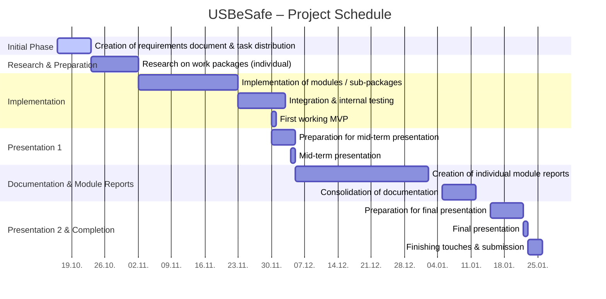

# Project Diary – **USBeSafe**

---

**Start date:** October 16, 2025 
**Planned end:** January 22, 2026 
**Responsible for updates:** All team members (weekly)

---

## Preliminary Timeline



---

## 1. Progress and Findings (Plan vs. Reality)

### Weeks 1–2: October 16 – 29, 2025  
*(Creation of the requirements document, role distribution, setup of repositories and development environment, and start of individual research on each work package.)*

In the first project phase, we focused on defining the **scope and foundation** of *USBeSafe*.
The goal was to clearly describe the use case, define the technical requirements in the **Requirements Specification (Pflichtenheft)**, and set up a common technical and organizational base for the team.
This included task distribution, creating a shared Git repository, and preparing a clean documentation structure for future development.


* **Requirements Specification (Pflichtenheft)**

    * **Responsible:** *All members*

    The group collaborated on defining the functional and non-functional requirements of the USBeSafe system.
    This includes:

    - Describing the system’s purpose (USB data transfer via virtualized sandbox environment)
    - Defining the workflow (automatic scan, VM isolation, safe re-import)
    - Establishing minimum deliverables (working CLI, scan report, mounting process)

    The Requirements Specification draft is managed collaboratively in the project repository under `docs/Requirements_Specifications.md`.


* **VM / Security Environment Setup**

    * **Responsible:** *Linus Rode*

    Initial research and configuration of a suitable virtual environment began.
    The focus was on exploring **Kali Linux** and **QEMU/KVM** setups to provide isolation for scanning operations.
    A first test VM was created to confirm compatibility with USB passthrough and automation.


* **Virtual USB & CLI Planning**

    * **Responsible:** *Paul Ilitz*

    The first concepts for the **virtual USB stick** and **CLI workflow** were developed.
    Paul explored how to create and mount virtual drives dynamically and defined the interface between CLI commands and the VM startup process.


* **Virus Scan Architecture**

    * **Responsible:** *Constantin Scheryer*

    Research began into possible scanning tools and frameworks.
    The focus was on lightweight and scriptable options such as **ClamAV**, along with ideas for an **“ampel” (traffic-light)** scoring system to visually indicate scan results.


* **Detection of BadUSB**
  * **Responsible:** *Tizian Everke & Richard Kats*
  
  We identified that USB Devices with malicious firmware that makes e.g. a USB Stick identify as a Keyboard are an additional attack vector. Therefore, it should be 
taken into account during the development of USBeSafe.
  * [USBGuard](https://usbguard.github.io/) Tool from RedHat
    * Provides White- and Blacklisting capabilities
    * uses the USB Authorization Feature (in Kernel) => source [Linux-Bibel](https://linux-bibel.at/index.php/2024/07/31/usb-guard-reglementierung-von-usb-geraeten/)
  * **Investigations**
    * Set `authorized_default` of USB busses to `0` (= don't authorize new devices)
      * -> `echo 0 | sudo tee /sys/bus/usb/devices/usb[1-9]+/authorized_default`
      * Resets back to `1` after PC gets restarted -> write 0's at start of daemon
      * **Plug in USB Devices**
        * USB Stick:
          * authorized_default 1
            * `lsusb` shows USB Stick:  
              `Bus 002 Device 002: ID 0781:5581 SanDisk Corp. Ultra`
            * `usb-devices`
              ```
              T:  Bus=02 Lev=01 Prnt=01 Port=00 Cnt=01 Dev#=  4 Spd=5000 MxCh= 0
              D:  Ver= 3.20 Cls=00(>ifc ) Sub=00 Prot=00 MxPS= 9 #Cfgs=  1
              P:  Vendor=0781 ProdID=5581 Rev=01.00
              S:  Manufacturer=SanDisk
              S:  Product=Ultra
              S:  SerialNumber=030189e6db153dda20e91b2e0311403338c7499c48ae1f29fe05130fe2e40cc1e0bb000000000000000000005042ac84ff144b08815581079c26b449
              C:  #Ifs= 1 Cfg#= 1 Atr=80 MxPwr=896mA
              I:  If#= 0 Alt= 0 #EPs= 2 Cls=08(stor.) Sub=06 Prot=50 Driver=usb-storage
              E:  Ad=02(O) Atr=02(Bulk) MxPS=1024 Ivl=0ms
              E:  Ad=81(I) Atr=02(Bulk) MxPS=1024 Ivl=0ms
              ```
          * authorized_default 0
            * `lsusb` shows USB Stick (see above)
            * `usb-devices`
              ```
              T:  Bus=02 Lev=01 Prnt=01 Port=00 Cnt=01 Dev#=  3 Spd=5000 MxCh= 0
              D:  Ver= 3.20 Cls=00(>ifc ) Sub=00 Prot=00 MxPS= 9 #Cfgs=  1
              P:  Vendor=0781 ProdID=5581 Rev=01.00
              S:  Manufacturer=SanDisk
              S:  Product=Ultra
              S:  SerialNumber=030189e6db153dda20e91b2e0311403338c7499c48ae1f29fe05130fe2e40cc1e0bb000000000000000000005042ac84ff144b08815581079c26b449
              C:  #Ifs= 0 Cfg#= 0 Atr= MxPwr=
              /usr/bin/usb-devices: 89: cannot open /sys/bus/usb/devices/usb2/2-1/2-*:?.*/bInterfaceNumber: No such file
              /usr/bin/usb-devices: 90: cannot open /sys/bus/usb/devices/usb2/2-1/2-*:?.*/bAlternateSetting: No such file
              /usr/bin/usb-devices: 91: cannot open /sys/bus/usb/devices/usb2/2-1/2-*:?.*/bNumEndpoints: No such file
              /usr/bin/usb-devices: 92: cannot open /sys/bus/usb/devices/usb2/2-1/2-*:?.*/bInterfaceClass: No such file
              /usr/bin/usb-devices: 93: cannot open /sys/bus/usb/devices/usb2/2-1/2-*:?.*/bInterfaceSubClass: No such file
              /usr/bin/usb-devices: 94: cannot open /sys/bus/usb/devices/usb2/2-1/2-*:?.*/bInterfaceProtocol: No such file
              I:  If#= 0 Alt= 0 #EPs= 1 Cls=09(hub  ) Sub=00 Prot=00 Driver=(none)
              ```
            * Keyboard
              * authorized_default 1
                * `lsusb` shows Keyboard:  
                  `Bus 001 Device 021: ID 1ea7:2007 SHARKOON Technologies GmbH SHARK ZONE K30 Illuminated Gaming Keyboard`
                * `usb-devices`
                  ```
                  T:  Bus=01 Lev=01 Prnt=01 Port=00 Cnt=01 Dev#= 21 Spd=12   MxCh= 0
                  D:  Ver= 2.00 Cls=00(>ifc ) Sub=00 Prot=00 MxPS= 8 #Cfgs=  1
                  P:  Vendor=1ea7 ProdID=2007 Rev=01.06
                  S:  Manufacturer=WFDZ
                  S:  Product=Gaming Keyboard
                  C:  #Ifs= 2 Cfg#= 1 Atr=a0 MxPwr=100mA
                  I:  If#= 0 Alt= 0 #EPs= 1 Cls=03(HID  ) Sub=01 Prot=01 Driver=usbhid
                  E:  Ad=81(I) Atr=03(Int.) MxPS=   8 Ivl=1ms
                  I:  If#= 1 Alt= 0 #EPs= 1 Cls=03(HID  ) Sub=00 Prot=00 Driver=usbhid
                  E:  Ad=82(I) Atr=03(Int.) MxPS=  32 Ivl=1ms
                  ```
              * authorized_default 0
              * `lsusb` shows Keyboard (see above)
              * `usb-devices`
                ```
                T:  Bus=01 Lev=01 Prnt=01 Port=00 Cnt=01 Dev#= 22 Spd=12   MxCh= 0
                D:  Ver= 2.00 Cls=00(>ifc ) Sub=00 Prot=00 MxPS= 8 #Cfgs=  1
                P:  Vendor=1ea7 ProdID=2007 Rev=01.06
                S:  Manufacturer=WFDZ
                S:  Product=Gaming Keyboard
                C:  #Ifs= 0 Cfg#= 0 Atr= MxPwr=
                /usr/bin/usb-devices: 89: cannot open /sys/bus/usb/devices/usb1/1-1/1-*:?.*/bInterfaceNumber: No such file
                /usr/bin/usb-devices: 90: cannot open /sys/bus/usb/devices/usb1/1-1/1-*:?.*/bAlternateSetting: No such file
                /usr/bin/usb-devices: 91: cannot open /sys/bus/usb/devices/usb1/1-1/1-*:?.*/bNumEndpoints: No such file
                /usr/bin/usb-devices: 92: cannot open /sys/bus/usb/devices/usb1/1-1/1-*:?.*/bInterfaceClass: No such file
                /usr/bin/usb-devices: 93: cannot open /sys/bus/usb/devices/usb1/1-1/1-*:?.*/bInterfaceSubClass: No such file
                /usr/bin/usb-devices: 94: cannot open /sys/bus/usb/devices/usb1/1-1/1-*:?.*/bInterfaceProtocol: No such file
                I:  If#= 0 Alt= 0 #EPs= 1 Cls=09(hub  ) Sub=00 Prot=00 Driver=(none)
                ```
      * **Observations**
        * When `authorized_default` is set to 0...
          * driver is always `none` -> it is not loaded
          * metadata is available (vendor, product, ...)
          * `Dev#` gets incremented when device is reinserted
          * Keyboard lights are off
          * USB Stick is not mounted
          * Keyboard is not usable
        * When `authorized_default` is set to 1...
          * Keyboard loads driver `usbhid`
          * USB Stick loads driver `usb-storge`
      * **TODO**
        * [ ] Can we see USB Events in [udev monitor crate](https://crates.io/crates/udev)? (when authorized_default is 0)
        * [ ] Can we forward an unauthorized usb stick to the VM?
        * [ ] Can we still see the type of device?
        


* **USB Pass-Through (Host → VM)**

    * **Responsible:** *Tizian Everke & Richard Kats*

    Investigation started into identifying USB devices on the host before enumeration to prevent malicious device behavior.
    First notes were collected on how **VirtualBox USB filters** or **udev rules** might be used to safely forward the device into the VM.


* **GUI Concept**

    * **Responsible:** *Aaron Debebe*

    A simple draft for the **graphical interface** was created, focusing on user feedback and automation flow:

    - Automatic display of scanning progress
    - Traffic-light visualization for results
    - Safe mounting button after successful scan

---

### Weeks 3–4: October 30 – November 12, 2025  
*(Research and design of the first prototypes for individual components, coordination between modules.)*

---

### Weeks 5–6: November 13 – 26, 2025  
*(Start of implementation of each module, ensuring compatibility, and establishing the internal testing workflow.)*

---

### Weeks 7–8: November 27 – December 10, 2025 *(Mid-term presentation)*  
*(Finalizing first implementation, preparing presentation slides, and presenting the mid-term results.)*

---

### Weeks 9–10: December 11 – 24, 2025  
*(Bug fixing, improving the codebase, and beginning to write the module documentation and individual reports.)*

---

### Weeks 11–12: December 25, 2025 – January 7, 2026  
*(Merging and aligning all parts of the documentation, refining features, and collecting feedback.)*

---

### Weeks 13–14: January 8 – 22, 2026 *(Final presentation)*  
*(Preparation for final presentation, last adjustments, quality review, and final submission.)*

---