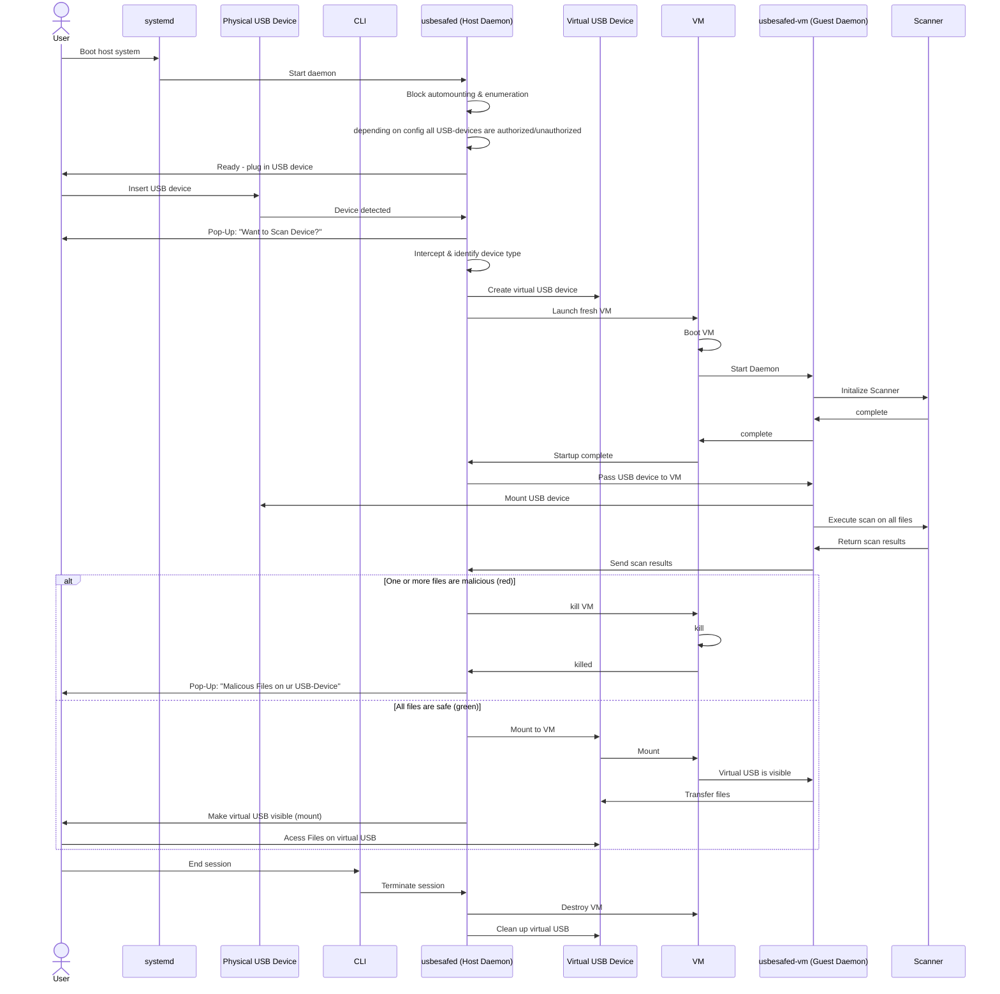
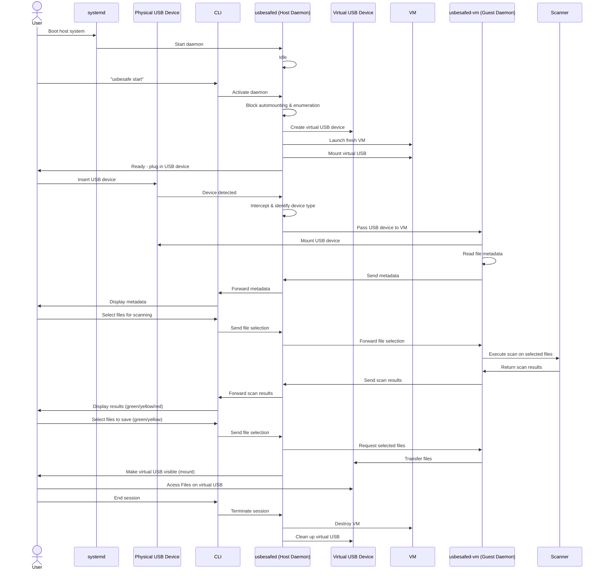

# USBeSafe

---

**Start date:** October 16, 2025  
**Planned end:** January 22, 2026  
**Responsible for updates:** All team members  

---

### Minimum requirements for the project:
- A functioning CLI tool that scans USB sticks for malware, displays a report in _Nautilus_, and mounts the stick on the host system afterwards

### USBeSafe Workflow

1. `usbesafed` is started by systemd on boot
2. `usbesafed` will now block automounting and enumerating USB devices. Depending on the config, all devices are unauthorized/authorized
2. `usbesafed` creates a virtual USB device and launches a fresh VM
3. User plugs in a device
4. `usbesafed` intercepts the device and identifies that it actually is a USB device
5. After examination, `usbesafed` passes the USB device to `usbesafed-vm` inside the VM
6. `usbesafed-vm` mounts the USB device
7. `usbesafed-vm` autmatically scans all files on the devices
8. `usbesafed-vm` sends a boolean to `usbesafed` wheather all files are safe (true) or one or more are bad (false) and a short description which files are bad
9.  If true: `usbesafed` mounts the virtual usb stick to the guest vm and make it visible for the host system restarts the VM

### USBeSafe Workflow with File selection

1. User activates `usbesafed` via the CLI
2. `usbesafed` will now block automounting and enumerating USB devices
2. `usbesafed` creates a virtual USB device and launches a fresh VM
3. User is informed that USB device can now be plugged in
4. `usbesafed` intercepts the device and identifies that it actually is a USB device
5. After examination, `usbesafed` passes the USB device to `usbesafed-vm` inside the VM
6. `usbesafed-vm` mounts the USB device
7. `usbesafed-vm` sends metadata of the files to `usbesafed` which sends it to the CLI
8. The CLI displays the metadata to the user and lets it select files for scanning
9. The selected files are sent to `usbesafed` which forwards it to `usbesafed-vm`
10. `usbesafed-vm` executes the scanner on those files, the results are sent back to `usbesafed` and then to the CLI
11. The CLI displays the scanning results based on their scores (green, yellow, red)
12. The user selects which scanned files (green/yellow) should be saved on the host
13. Those files are sent to `usbesafed` which sends it to `usbesafed-vm` and writes it to the virtual USB device
14. `usbesafed` makes the virtual USB device visible to the user (mount?)
15. After the session is done (via some user input), `usbesafed` destroys the VM

### Ideas:
- [ ] Shared Zotero group for literature? → unified `.bib` file  
- [ ] Final paper in Overleaf (requires Premium) or directly within the project?  

---

## Work Packages & Responsibilities

| ID  | Module / Task                              | Responsible                  |
|-----|--------------------------------------------|------------------------------|
| A1  | **VM / Security environment**              | Linus Rode                   |
| A2  | **Virtual USB stick**                      | Paul Ilitz                   |
| A3  | **CLI (VM start, USB script)**             | Paul Ilitz                   |
| A4  | **Virus scan**                             | Constantin Schreyer          |
| A5  | **Detect BadUSB**                          | Richard Kats & Tizian Everke |
| A6  | **USB pass-through Host → VM (interface)** | Richard Kats & Tizian Everke |
| A7  | **GUI (automated file management)**        | -                            |
| A8  | **Host side daemon**                       | Linus Rode, Richard Kats & Tizian Everke, Paul Ilitz                    |
| A9  | **Guest side daemon**                      | Linus Rode                   |
| A9  | **Monitoring & Tests**                     | Aaron Debebe                 |
| A10 | **Projektleitung**                         | Linus Rode, Paul Ilitz       |
| A11 | **Modularbeit**                            | All                          |
| A12 | **Zwischenpräsentation**                   | All                          |
| A13 | **Abschlusspräsentation**                  | All                          |
| A14 | **Risikoanalyse**                          | Paul Ilitz                          |

---

# A1. VM / Security Environment: Linus Rode

## Purpose  
The VM provides the isolated execution environment for all USBeSafe operations.  
It acts as the backbone of the system by securely running the scanning and file-handling processes without exposing the host to any risk.  

## Concept  
A lightweight, disposable virtual machine or container will be used to handle all USB data.  
It should support a simple GUI for file browsing and scanning, allow temporary package installation, and be fully resettable after each use.  
The goal is to guarantee complete separation between host and guest.

## Technology Comparison  
| Option | Pros | Cons | Notes |
|--------|------|------|------|
| **QEMU/KVM** | Strong isolation, mature, GUI support (SPICE/VNC), full system reset possible | Slightly heavier resource use | Most secure and flexible option |
| **Kata Containers** | Fast startup, container tooling with VM isolation | GUI setup more complex, less common | Possible compromise between speed and security |
| **Podman / Docker** | Very lightweight, easy automation | Shares host kernel → not secure against kernel-level exploits | Suitable only for prototypes |
| **Firecracker / MicroVMs** | Extremely small attack surface | No GUI support, limited package options | Not practical for our use case |

**Initial direction:** QEMU/KVM, as it offers full isolation and a working GUI environment.

## Operating System  
A minimal Linux distribution (e.g., Debian, Ubuntu, or Alpine-based) with a lightweight desktop environment such as XFCE or LXQt.  
The OS must be stateless, easily rebuilt, and capable of running common Linux tools.

#### Security Requirements  
- The guest must have **no network connection** to the host or internet.  
- No shared folders or host mounts.  
- Access only to controlled virtual devices (USB image or passthrough).  
- VM reset after each use (delete overlay or rebuild image).  
- Host and hypervisor run with limited privileges and updated packages.  

## Reset and Rebuild  
After each scan session, the VM will be destroyed and re-created from a clean base image.  
This guarantees no persistence of data or configuration between sessions.  
Automated scripts will handle overlay deletion and reinitialization.

## Problems and Risks  
- Balancing startup speed and isolation strength.  
- GUI forwarding performance under strong sandboxing.  
- Managing large USB images or complex partition layouts.  
- Keeping rebuild times short while ensuring integrity.

## Overlapping Points with Other Modules  
- Must accept and expose virtual USB device for **Step 2 (Virtual USB stick)**  
- Must be run by the CLI Tool in **Step 3 CLI (VM start, USB script)**  
- Must allow package installation for **Step 4 (Virus scanner)**  
- Must handle USB passthrough coordination with **Step 5 (Host → VM interface)**  
- Must support GUI display for **Step 6 (GUI module)**  

## Output  
A documented and reproducible virtual environment that can start, display a GUI, run scanning tasks, and be securely reset after each use.

## Sources  
- [QEMU/KVM official documentation](https://www.qemu.org/docs/master/)
- [Container Security: Issues, Challenges, and the Road Ahead](https://ieeexplore.ieee.org/abstract/document/8693491)
- [Comparison between security majors in virtual machine and linux containers](https://arxiv.org/abs/1507.07816)

---

# A2. Virtual USB Stick: Paul Ilitz

## Purpose
The core concept behind the virtual USB stick is to create a secure intermediary storage space that can be accessed from both the host system and the virtual machine.  
This virtual device should operate with dynamic permission controls, starting in a read-only mode and transitioning to read-write access only after the scanned data has been verified as clean.  
The main purpose is to deliver the safe files from the VM back to the host system.

## Workflow of the virtual USB-Stick
1. When the Deamon is started by the CLI script, a virtual USB stick will be automatically created
2. Initially, this virtual device will be mounted as read-only for both the host system and the VM
3. The size of the virtual USB stick will be dynamically adjusted to match either the file size of the data on the physical USB stick or the total capacity of the USB stick itself
4. Once the malware scanning process completes, the system will respond based on the scan results:
	- **If all files are classified as green (safe) or yellow (potentially suspicious but not dangerous):**  
	    - The virtual USB stick will be switched to read-write mode for the VM  
	    - The user will be presented with the option to select which files should be transferred to the host system, providing granular control over data flow
	- **If any files are flagged as red (malicious):**  
 	    - The system will initiate an automatic cleanup procedure  
   	    - The virtual USB stick will be destroyed after a 30-second countdown
5. When the VMor Daemon is terminated, either manually by the user or automatically by the system:
	- The virtual USB stick and all files stored on it will be immediately deleted [or should the virtual stick stay to keep the safe data?]
	- This ensures that no residual data remains that could pose a security risk

## Security Considerations
- **VM escape attacks**: The virtual USB stick represents a communication channel between the isolated VM and the host system
- **Data leakage**: Malicious code might access the virtual stick before it is properly isolated or destroyed
- **Size estimation challenges**: Technical difficulties when dealing with USB devices that may contain hidden partitions, zipped files or report incorrect capacity information

## Technical Approaches
**Option 1: Shared Folder Mechanism**
- Advantages:
  - Simplicity and ease of implementation
  - No special drivers required
  - Straightforward permission control
  - Well-supported by most virtualization platforms
- Disadvantages:
  - Not truly a USB device
  - Might not behave exactly like a physical USB stick in all scenarios

**Option 2: Disk Image Emulation**
- Advantages:
  - Behaves like an actual USB device
  - Better isolation between the VM and host system
- Disadvantages:
  - More complex to implement
  - Requires careful filesystem operations
  - Presents challenges in dynamic size management

## Overlapping Points with Other Modules  
- Must be created and managed by **A8 (Host side daemon)** at startup
- Must be mounted and accessible to both the host system and the VM in **A1 (VM / Security Environment)**
- Must accept scanned files from **A9 (Guest side daemon)** after successful malware verification
- Must integrate with **A3 (CLI)** and **A7 (GUI)** for file transfer operations
- Must enforce read-only/read-write permissions based on scan results from **A4 (Virus scan)**

## Sources
- [How to create a disk image](https://unix.stackexchange.com/questions/328156/create-virtual-usb-drive) -> [fallocate](https://man7.org/linux/man-pages/man1/fallocate.1.html)
- [Linus MSG](https://www.kernel.org/doc/Documentation/usb/mass-storage.txt)
- [Raw Gadget](https://github.com/xairy/raw-gadget)
- [Shared Folder](https://askubuntu.com/questions/161759/how-to-access-a-shared-folder-in-virtualbox)

---

# A3. CLI (VM Lifecycle & USB Orchestration): Paul Ilitz

## Purpose
The CLI serves as the central orchestrator of the USBeSafe workflow. It manages the complete lifecycle of the daemon, detects and handles USB devices, coordinates the malware scanning process and virtual USB mechanism, and provides clear status updates with robust error recovery for the user.

## Core Responsibilities
- **VM lifecycle management**: Start, monitor, configure, and securely destroy or reset the virtual machine
- **USB detection and handling**: Monitor device insertion, classify device type (storage vs. other usb devices), disable host automounting, and coordinate safe passthrough to the VM
- **Component coordination**: Serve as the control plane between GUI, scanner, virtual USB device, and VM, exposing a stable connection for other modules
- **User interaction**: Provide concise, actionable command-line prompts, progress indicators, and final reports
- **Robust error handling and cleanup**: Ensure deterministic rollback, VM shutdown, and removal of temporary artifacts on any failure

## User-Facing Commands
The CLI exposes a composable command set that supports both interactive and automated use:
1. `daemon start | stop` — Run a background manager that prepares the environment (disable automount, pre-create virtual USB, enforce policies, handle vm)
2. `list-devices | watch-devices` — Enumerate attached USB devices and monitor for insertion events
3. `scan [--paths ...]` — Execute malware scans inside the VM; allow interactive or batch selection of files to scan
4. `transfer` — After successful scanning, select files to copy to the virtual USB and enable controlled host access
5. `vm restart | destroy` — Reset the VM to a clean base image
6. `config [show|edit]` — Manage settings (VM image, timeouts, scan engines, security policies)

## Technical Considerations
- **Target platform**: Linux
- **Privilege model**: Clearly document required elevated permissions and minimize the privileged footprint
- **Security**: Default-deny approach — guest has no network access, no shared mounts, and the virtual USB remains read-only until files are approved
- **Implementation language**: Python with [click](https://click.palletsprojects.com/en/stable/entry-points/) as main Framework, chosen for system-level capabilities and cross-platform support
- **Observability**: Structured logs and machine-readable outputs (JSON) for integration with GUI and automation
- **Configuration**: Support human-editable config files (YAML/TOML/INI) with environment variable overrides

## Deliverable
A production-ready CLI tool implementing the VM/USB workflow, with documented commands, example configuration, comprehensive logging, and clear instructions for required privileges and platform setup.

## Overlapping Points with Other Modules  
- Must start, configure, and control **A8 (Host side daemon)** lifecycle
- Must coordinate with **A5 (Detect BadUSB)** and **A6 (USB pass-through)** for device detection and classification
- Must trigger creation of **A2 (Virtual USB stick)** through the daemon
- Must launch and manage **A1 (VM / Security Environment)** instances
- Must initiate and orchestrate **A4 (Virus scan)** execution inside the VM
- Must communicate with **A9 (Guest side daemon)** for file operations and scan results
- Is used by **A7 (GUI)** 

---

# A4. Virus Scan & Traffic-Light System: Constantin Schreyer

## Purpose
The function of virus scan is to provide a file scanner which focusses on being lightweight and configurable. Depending on the specific setting (file types, file sizes, file count etc.) it is able to inspect the files for different types of malware which could harm the host system. The virus scanner returns simple classes for easy understanding of the harm potential of each file.

## Virus Scanner
We aim to present different virus scanner and their advantages and disadvantages. We explain the different types of malware detection (e.g. signature based, heuristic based, behavior based etc.) and which one is suited best for our application.
We implement one such virus scanner for our application.

## Traffic Light System
Goal of such a system is to ensure simplicity and comprehensibility for the end user. In the end, the virus scanner will categorise the different files into one of three classes/colors:
- **Green:** No danger is likely to be posed to the system.  
- **Yellow:** It can not be ruled out that harm might be taken to the system.  
- **Red:** Immediate danger is likely to be posed to the system.  
For more context, brief reasoning may be provided.

---

# A5. Detect BadUSB: Richard Kats

## Purpose

...

---

# A6. USB Pass-Through Host → VM (Interface): Tizian Everke & Richard Kats

## Purpose

We aim to identify an inserted USB stick (is it a keyboard? a flash drive?) and pass it through to the VM.

## Thoughts / Notes:
- Detect whether it’s really a USB stick (or a keyboard, mouse, etc.) → defined in firmware  
- If yes, determine how USB filters (e.g., in VirtualBox) work and forward the device to the VM  
- Do not mount on the host until the scan is complete (success or exception can be communicated via SSH)

## Proposed Process / Possible Solution
1. CLI tool (Rust?) is started by the user  
2. CLI tool prompts the user to insert a USB device  
3. Detect what kind of device was inserted (USB stick, keyboard, …) (driver level?)  
   - [ ] Ideally **before enumeration!** USB sticks often have malicious firmware that pretends to be a keyboard (read papers)  
   - [ ] Where does enumeration happen?  
   - [ ] What exactly happens during enumeration?  
   - [ ] How can enumeration be aborted if it’s not a USB stick (while the tool is running)?  
   → Ensures that a USB stick cannot pretend to be, e.g., a keyboard  
4. Start VM *  
5. Run virus scan *  
6. Display result *  
7. Show data on host system *  

## Possible Issues
- At which layer does inserting a USB stick become dangerous? (driver level, …)  
- A USB stick might have smaller or multiple (hidden?) partitions to conceal data  
- Most USB-based malware resides in the firmware  
  - How and where could this be detected?  

## Sources
Some useful documentation and links:
- [What is meant by mounting a device in Linux?](https://unix.stackexchange.com/a/3194)
- [Understanding Mount Points and How They Work](https://www.linuxbash.sh/post/understanding-mount-points-and-how-they-work)
- [How to Mount File System in Linux | mount Command](https://www.geeksforgeeks.org/linux-unix/mount-command-in-linux-with-examples/)
- [How to Check Whether a USB Device Is Present on a Linux Machine](https://www.baeldung.com/linux/check-for-usb-devices)
- [How to Disable Auto-Mounting of Devices](https://www.baeldung.com/linux/ubuntu-disable-automated-mounting)
- [[Video] How to Mount USB Drive in Terminal on Linux: A Step-by-Step Tutorial](https://www.youtube.com/watch?v=t1MCbL95Xcg)  
_(This tutorial also shows how to trust a specific device)_

--> More sources can be found in the shared Zotero group, to be added here later  

---

# A7. GUI (Automated File Management): Aaron Debebe

## Purpose
Providing an intuitive interface for the user to securely interact with an USB device.

## Features
1. Option to activate/deactivate host side daemon
2. File View
    - GUI (Qt or GTK), displaying the sanitized contents (metadata only) of the USB device
3. Option to start scanning selected files
4. Traffic Light Visualization
    - Files are colored based on scan results:
        - Green: Safe
        - Yellow: Potentially suspicious
        - Red: Malicious -> encrypt it?
    - Maybe display animated spinner while scanning
5. File Operations
    - Copy files to host system after scanning (only Green, maybe Yellow?)
    - Option to select multiple files for transfer
    - Option to delete files?
6. Timer & VM Reset
    - A countdown timer is displayed. During the timer, the user can interact with the files.
    - Once the timer expires -> VM reset
    - Also allow option for the user to abort the session/vm manually
7. Logging
    - Log users action (file selection, transfers, etc.)
8. Export report
    - Option to export a report
    - Following should be interesting: metadata (name, size, type, etc.), sha256, (scanners used), scanning result, timestamps
    - The report should be saved on the host system
    - Maybe sign the report?
    - JSON/YAML + PDF/HTML
## Communication with other components
- Host side daemon via ICP (unix socket)
    - activate, deactivate the daemon
    - request metadata of files of currently connected USB device
    - request scanning of selected files
    - file operations
        - request certain/all files to be written to the virtual USB device by the daemon
    - reset current vm/abort current session

---

# A8. Host side daemon: Aaron Debebe

## Purpose

Provide communication between the host side components (CLI and GUI) and the guest.

## Features

0. As `systemd` service?
1. Incorporate USB block+ident (A5)
2. Create virtual USB device (A2)
2. Launch a fresh VM with USB passthrough and `virtio-serial` when the daemon gets triggered by CLI/GUI (A1,A7)
3. Destroy VM after session is done (Timer expired, user abort, etc.)
4. Redirect requests from CLI/GUI to the guest side daemon and responses back to the CLI/GUI
    - metadata, scanning, etc.
5. Copy selected files to the virtual USB device

## Communication with other components
- Host side components (CLI/GUI) via ICP (unix socket)
- Guest side daemon via `virtio-serial` channel

---

# A9. Guest side daemon: Linus Rode

## Purpose

...
