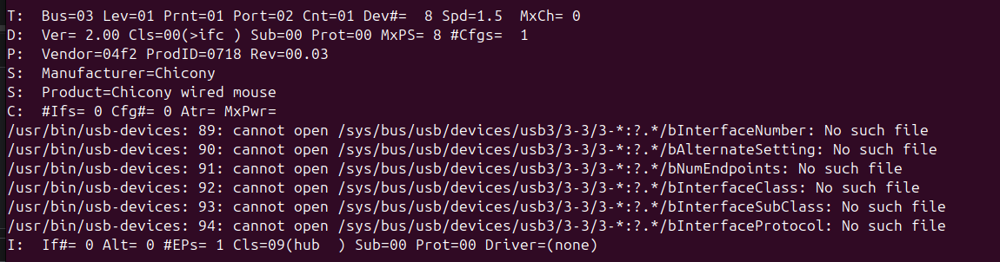
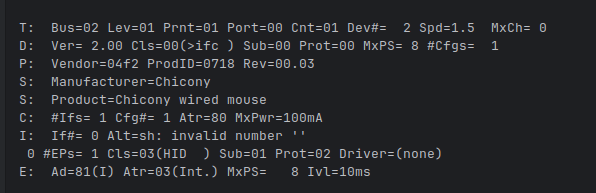
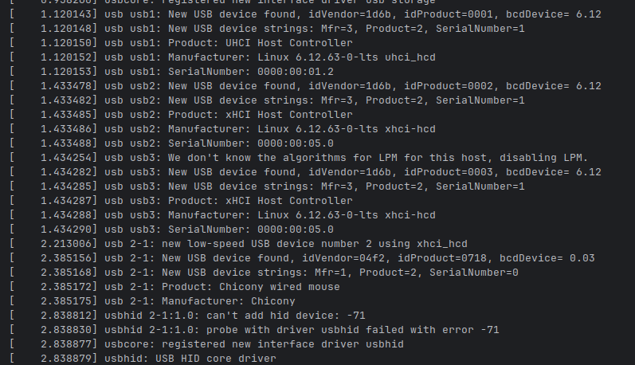
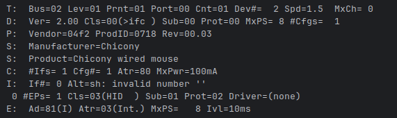
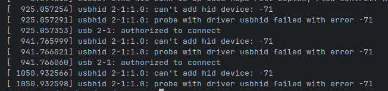
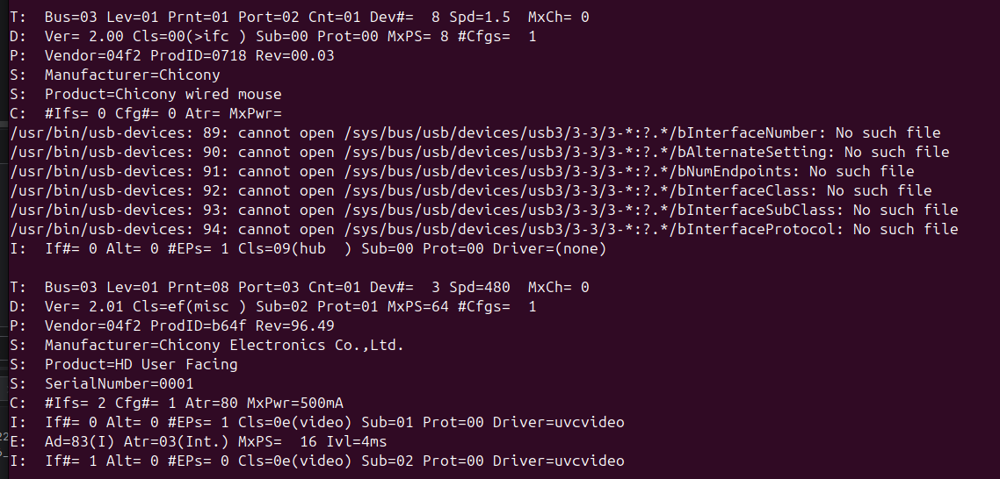
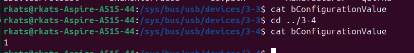
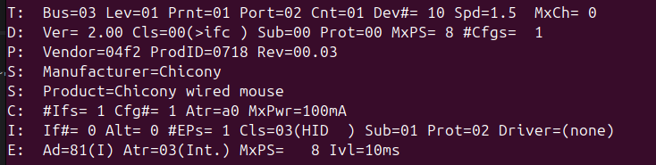

# Protection against and Detection of Bad USB Attacks inside the VM

Current decisions to consider:

- BAD_USB_PROTECTION is configurable (can be turned off -> only malware scan for storage devices)
- whole USB Controller is passed to vm:
    - How to find the device to check?
    - How to protect the other devices from being manipulated?

One idea to protect the other devices inside the vm is to set every device to unauthorized using a udev rule.
But this will also set the root USB Hubs to being unauthorized (authorized=0), meaning there can't be any interaction
with the USB devices we want to scan.

Another idea is to set the authorized_default parameter of the root hubs to 0, better said to disable it.
This way all connected usb devices will be unauthorized and have to be authorized explicitly.
To achieve this, we can extend the APPEND section of the extlinux.conf file (found at /boot/extlinux.conf)
by "usbcore.authorized_default=0." (source of kernel
param: https://www.kernel.org/doc/html/v5.0/admin-guide/kernel-parameters.html)
(LATER: dont do it in append! do this: virt-customize -a alpine-base.qcow2 \
--run-command 'sed -i "s/^default_kernel_opts=\"\(.*\)\"/default_kernel_opts=\"\1 usbcore.authorized_default=0\"/"
/etc/update-extlinux.conf' \
--run-command 'update-extlinux')

But maybe this is not necessary!

## New Idea:

As our previous try, as mentioned, with passing an unauthorized USB device to the VM and authrorizing it there did not
work as planned,
now there was another idea. Passing the whole PCI controller to the VM worked, but was cumbersome and hard to automate,
as previously mentioned
by Tizian.
Question: How can we just diable loading of the drivers or usbhid in particular? Passing an authorized USB device to the
VM worked.
Another idea: Disable driver_autoprobing when a new USB Device is plugged in and authorize it on the host. This way no
drivers
should be loaded but the device is authrozied. authorize_default is still set to 0. (TODO: Find way to set it early!)

Try:

- Disable driver_autoprobing when a new USB Device is plugged in and authorize it on the host.

### Observation:

Yes, with disabled driver autoprobing drivers are not loaded for the authorized device. (Trying with a mouse)

```
T:  Bus=03 Lev=01 Prnt=01 Port=02 Cnt=01 Dev#=  8 Spd=1.5  MxCh= 0
D:  Ver= 2.00 Cls=00(>ifc ) Sub=00 Prot=00 MxPS= 8 #Cfgs=  1
P:  Vendor=04f2 ProdID=0718 Rev=00.03
S:  Manufacturer=Chicony
S:  Product=Chicony wired mouse
C:  #Ifs= 0 Cfg#= 0 Atr= MxPwr=
/usr/bin/usb-devices: 89: cannot open /sys/bus/usb/devices/usb3/3-3/3-*:?.*/bInterfaceNumber: No such file
/usr/bin/usb-devices: 90: cannot open /sys/bus/usb/devices/usb3/3-3/3-*:?.*/bAlternateSetting: No such file
/usr/bin/usb-devices: 91: cannot open /sys/bus/usb/devices/usb3/3-3/3-*:?.*/bNumEndpoints: No such file
/usr/bin/usb-devices: 92: cannot open /sys/bus/usb/devices/usb3/3-3/3-*:?.*/bInterfaceClass: No such file
/usr/bin/usb-devices: 93: cannot open /sys/bus/usb/devices/usb3/3-3/3-*:?.*/bInterfaceSubClass: No such file
/usr/bin/usb-devices: 94: cannot open /sys/bus/usb/devices/usb3/3-3/3-*:?.*/bInterfaceProtocol: No such file
I:  If#= 0 Alt= 0 #EPs= 1 Cls=09(hub  ) Sub=00 Prot=00 Driver=(none)
```

This is the output of `usb-devices` command with disabled driver autoprobing, authorized_default 0 and authorized of
this device to 1.
Drivers are not loeaded (= none)! The devices class is 9 (usb hub) though, and it seems it could still not be configured
correctly
due to the errors above.



If the tool is run now, the mouse is detected by it as usual, and the user is prompted to either scan the device or
abort.
The device is then forwarded to the vm.



```
T:  Bus=02 Lev=01 Prnt=01 Port=00 Cnt=01 Dev#=  2 Spd=1.5  MxCh= 0
D:  Ver= 2.00 Cls=00(>ifc ) Sub=00 Prot=00 MxPS= 8 #Cfgs=  1
P:  Vendor=04f2 ProdID=0718 Rev=00.03
S:  Manufacturer=Chicony
S:  Product=Chicony wired mouse
C:  #Ifs= 1 Cfg#= 1 Atr=80 MxPwr=100mA
I:  If#= 0 Alt=sh: invalid number ''
 0 #EPs= 1 Cls=03(HID  ) Sub=01 Prot=02 Driver=usbhid
E:  Ad=81(I) Atr=03(Int.) MxPS=   8 Ivl=10ms
```

Unfortunately the driver of the mouse is not loaded in the vm, even though it is authorized=1 there. Weird!
Let's take a look at dmesg (grep usb):


```
[    1.120143] usb usb1: New USB device found, idVendor=1d6b, idProduct=0001, bcdDevice= 6.12
[    1.120148] usb usb1: New USB device strings: Mfr=3, Product=2, SerialNumber=1
[    1.120150] usb usb1: Product: UHCI Host Controller
[    1.120152] usb usb1: Manufacturer: Linux 6.12.63-0-lts uhci_hcd
[    1.120153] usb usb1: SerialNumber: 0000:00:01.2
[    1.433478] usb usb2: New USB device found, idVendor=1d6b, idProduct=0002, bcdDevice= 6.12
[    1.433482] usb usb2: New USB device strings: Mfr=3, Product=2, SerialNumber=1
[    1.433485] usb usb2: Product: xHCI Host Controller
[    1.433486] usb usb2: Manufacturer: Linux 6.12.63-0-lts xhci-hcd
[    1.433488] usb usb2: SerialNumber: 0000:00:05.0
[    1.434254] usb usb3: We don't know the algorithms for LPM for this host, disabling LPM.
[    1.434282] usb usb3: New USB device found, idVendor=1d6b, idProduct=0003, bcdDevice= 6.12
[    1.434285] usb usb3: New USB device strings: Mfr=3, Product=2, SerialNumber=1
[    1.434287] usb usb3: Product: xHCI Host Controller
[    1.434288] usb usb3: Manufacturer: Linux 6.12.63-0-lts xhci-hcd
[    1.434290] usb usb3: SerialNumber: 0000:00:05.0
[    2.213006] usb 2-1: new low-speed USB device number 2 using xhci_hcd
[    2.385156] usb 2-1: New USB device found, idVendor=04f2, idProduct=0718, bcdDevice= 0.03
[    2.385168] usb 2-1: New USB device strings: Mfr=1, Product=2, SerialNumber=0
[    2.385172] usb 2-1: Product: Chicony wired mouse
[    2.385175] usb 2-1: Manufacturer: Chicony
[    2.838812] usbhid 2-1:1.0: can't add hid device: -71
[    2.838830] usbhid 2-1:1.0: probe with driver usbhid failed with error -71
[    2.838877] usbcore: registered new interface driver usbhid
[    2.838879] usbhid: USB HID core driver
```

At the bottom, there is an error. The hid device could not be added due to error -71.
TODO: What is error -71? https://github.com/torvalds/linux/blob/master/include/uapi/asm-generic/errno.h
71 seems to be a protocol error.

Let's try to authorize 0 and authorize 1 and trigger driver probing manually.



No success, unfortunately. Driver is still "none".
Dmesg output:


Weird... let's investigate further on the host side.


This picture shows the mouse and an internal webcam of the test laptop.

Looking at the bConfigurationValue, the device seems not to be configured correctly. 3-3 is the mouse and 3-4 the
webcam.
bConfigurationValue is empty for the mouse! This seems to mean, that no configuration is seletected
for this usb device. Maybe it's stuck in some of the configuration states?
https://www.beyondlogic.org/usbnutshell/usb5.shtml
https://docs.kernel.org/usb/authorization.html

Let's try setting bConfigurationValue to 1 manually.
After setting bConfigurationValue to 1 during the execution of the script, usb-devices looks much healthier.
Driver is still none, which is good on the host!


```
T:  Bus=03 Lev=01 Prnt=01 Port=02 Cnt=01 Dev#= 10 Spd=1.5  MxCh= 0
D:  Ver= 2.00 Cls=00(>ifc ) Sub=00 Prot=00 MxPS= 8 #Cfgs=  1
P:  Vendor=04f2 ProdID=0718 Rev=00.03
S:  Manufacturer=Chicony
S:  Product=Chicony wired mouse
C:  #Ifs= 1 Cfg#= 1 Atr=a0 MxPwr=100mA
I:  If#= 0 Alt= 0 #EPs= 1 Cls=03(HID  ) Sub=01 Prot=02 Driver=(none)
E:  Ad=81(I) Atr=03(Int.) MxPS=   8 Ivl=10ms
```

Interestingly, now the correct device class is loaded (3 for HID).
Also, Ifs, Cfg and MxPwr is loaded! (TODO: what does it stand for?)
And now there is the E: at the bottom. It was not present before! (when bConfigurationValue was set to 0 on the host).

Let's see what's going on on the vm side. Output of `usb-devices` for the mouse on the vm:

```
T:  Bus=02 Lev=01 Prnt=01 Port=00 Cnt=01 Dev#=  2 Spd=1.5  MxCh= 0
D:  Ver= 2.00 Cls=00(>ifc ) Sub=00 Prot=00 MxPS= 8 #Cfgs=  1
P:  Vendor=04f2 ProdID=0718 Rev=00.03
S:  Manufacturer=Chicony
S:  Product=Chicony wired mouse
C:  #Ifs= 1 Cfg#= 1 Atr=80 MxPwr=100mA
I:  If#= 0 Alt=sh: invalid number ''
 0 #EPs= 1 Cls=03(HID  ) Sub=01 Prot=02 Driver=usbhid
E:  Ad=81(I) Atr=03(Int.) MxPS=   8 Ivl=10ms
```

The driver is loaded correctly this time, but it is not loaded on the host, even after setting bConfigurationValue to 1
manually!
So no damage can be done theoretically by a BadUSB on the host.

Now the scans have to run on the host, and after success the device is authorized on the host.
Also driver_autoprobing has to be enabled again, or maybe autoprobing can be disabled for the device on the host in
general.
and be called manually by the daemon.

For further investigations on why setting bConfigurationValue helped,
here is the output of usb-devices of an unprotected laptop (authorized, autoprobe, ...):

```
T:  Bus=03 Lev=01 Prnt=01 Port=02 Cnt=01 Dev#=  3 Spd=1.5  MxCh= 0
D:  Ver= 2.00 Cls=00(>ifc ) Sub=00 Prot=00 MxPS= 8 #Cfgs=  1
P:  Vendor=04f2 ProdID=0718 Rev=00.03
S:  Manufacturer=Chicony
S:  Product=Chicony wired mouse
C:  #Ifs= 1 Cfg#= 1 Atr=a0 MxPwr=100mA
I:  If#= 0 Alt= 0 #EPs= 1 Cls=03(HID  ) Sub=01 Prot=02 Driver=usbhid
E:  Ad=81(I) Atr=03(Int.) MxPS=   8 Ivl=10ms
```

---
Command to find usb by pid:
`grep -l "b64f" /sys/bus/usb/devices/*/idProduct`

# Experiment with bad usb

Pi Pico with this github project:
https://github.com/kacperbartocha/pico-badusb

With this Payload:

```
DELAY 1000
HOTKEY CTRL ALT T
DELAY 1000
STRING xdg-open https://youtu.be/dQw4w9WgXcQ
PRESS ENTER
```

Waits 1 s after inserting, Opens Terminal using Ubuntu Shortcut, opens default browser with rick roll url.

## Experiment 1: Does it execute with authorized_default 0?

Result: After setting all /sys/bus/usb/devices/usbX/authorized_default to 0 the above
BadUSB code is not executed.

## Experiment 2: Does it execute after authorizing?

Result: The BadUSB script is not executed when using authorized_default 0 and authorizing it manually.
The drivers are loaded, so a potential threat exists, depending on the programming of the firmware.

TODO: Check existence of input device?

## Experiment 3: Does it execute with authorized_default 0 + driver autoprobing 0 + authorized 1?

Result:

## Experiment 4: Does it execute with only driver autoprobing 0 (as default?)?

Result:
What are the drawbacks?

- not very convenient, but we could manually trigger driver probing after scans finished


