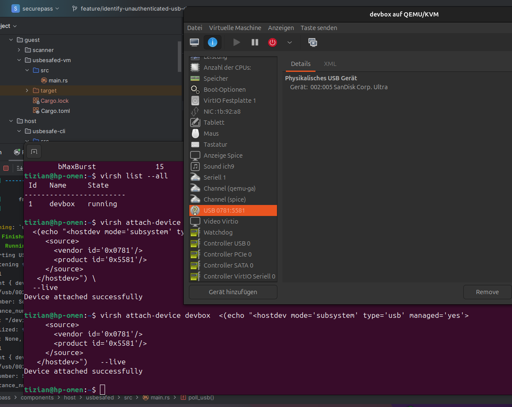
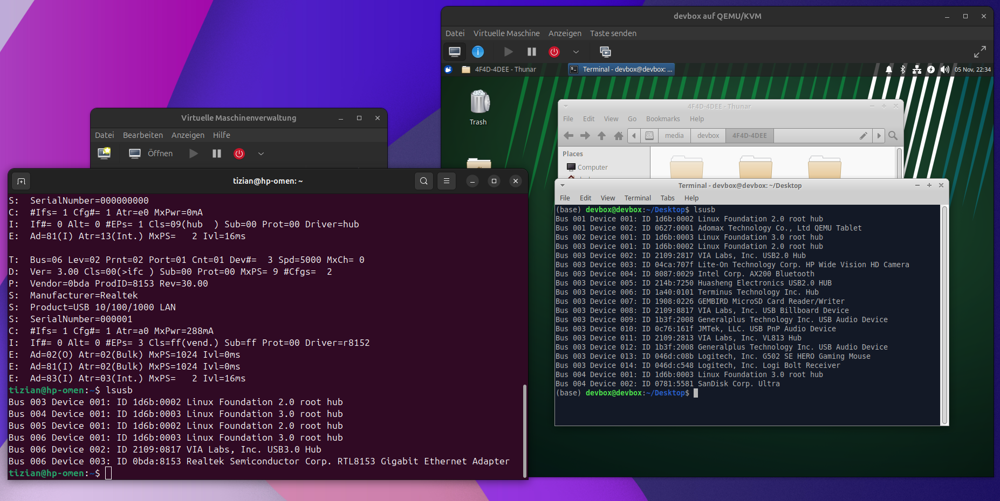

# Identifying unauthorized USB device when it's plugged in

Idea: We want to disable default authorization of USB devices when they're plugged in to prevent them from loading USB
drivers.

Questions:

- Can we and if so, how can we determine the device class of an unauthorized USB device? (Mass Storage, HID, ...)
- How can we pass an unauthorized USB flash drive to the VM?

## Write a simple Rust program that monitors udev events

Crate: udev, nix

```rust
use nix::libc::{nfds_t, pollfd, ppoll, POLLIN};
use std::io::Error;
use std::os::fd::AsRawFd;
use std::{io, ptr};

fn poll_usb() -> Result<(), Error> {
    println!("Starting USB device monitor...");

    let builder = udev::MonitorBuilder::new()?.match_subsystem("usb")?;

    let monitor = builder.listen()?;

    println!("Listening for 'add' events on the 'usb' subsystem...");

    let mut fds = vec![pollfd {
        fd: monitor.as_raw_fd(),
        events: POLLIN,
        revents: 0,
    }];

    loop {
        let result = unsafe {
            ppoll(
                (&mut fds[..]).as_mut_ptr(),
                fds.len() as nfds_t,
                ptr::null_mut(),
                ptr::null(),
            )
        };

        if result < 0 {
            return Err(io::Error::last_os_error());
        }

        let event = match monitor.iter().next() {
            Some(evt) => evt,
            None => {
                println!("Usb monitor None Event");
                thread::sleep(Duration::from_millis(10));
                continue;
            }
        };

        let device = event.device();

        let vendor = device.attribute_value("idVendor");

        println!("{}", vendor.unwrap().to_string_lossy());

        println!("{:?}", event);
    }
}
```

We were able to listen to events when a USB device was plugged in. We printed the events for the same device (USB stick)
when it's
authorized and unauthorized and compared it (see [authorized_event.txt](etc/authorized_event.txt)
and [unauthorized_event.txt](etc/unauthorized_event.txt)).

The main difference was, that when unauthorized, the logs shows `driver = None` and when authorized, the logs shows
`driver = Some("usb", "usb-storage", ...)`.
We can get the device path from the event too (e.g. `/dev/bus/usb/001/017`), which contains the USB bus and the device
id.

Also using the function `attribute_value`, it's possible to access the VendorId and many more attributes. Unfortunately
we had
an issue finding a standardized naming scheme (some use `vendor`, some use `idVendor` and some don't use it at all).

An attribute `bDeviceClass` is (always / sometimes -> further investigation required) present, which
gives information about the connected USB device. But if this attribute is written as
`ATTR{bDeviceClass}=="00"`, this means that all the devices information can be found in the `bInterfaceClass`.
Unfortunately this attribute is not always present. All codes can be
found [here](https://www.usb.org/defined-class-codes)

As far as we currently know, it's not possible to classify a device without e.g. fetching and using a VID/PID mapping
table [USB VID/PID table](http://www.linux-usb.org/usb.ids) (which most of the time does not allow for an identification
of a devices class) (for attributes
see [usb_mouse_unauth](etc/usb_mouse_unauth), [usb_stick_auth](etc/usb_stick_auth), [usb_stick_unauth](etc/usb_stick_unauth)).

Our idea (if it's not possible to classify the unauthorized device easily on the host side) is to maybe forward the
unauthorized USB Stick to the VM and authorize (load drivers, ...) there. This way we
could classify (and block) the device depending on which drivers it is requesting/using.

## Pass an unauthorized USB device to the VM

(not yet tested)

Using VID and PID:

```bash
virsh attach-device <vm-name>\
  <(echo "<hostdev mode='subsystem' type='usb' managed='no'>
     <source>
       <vendor id='0x1234'/>
       <product id='0x5678'/>
     </source>
   </hostdev>") \
  --live
```

Using Bus and ID:

```bash
virsh attach-device <vm-name>\ \
  <(echo "<hostdev mode='subsystem' type='usb' managed='no'>
     <source>
       <bus>1</bus>
       <device>16</device>
     </source>
   </hostdev>") \
  --live
```

If we use qemu to start the vm, add this to the command:
`-device usb-host,vendorid=0x1234,productid=0x5678` or `-device usb-host,hostbus=1,hostaddr=16`.

## 06.11.2025

Forwarding an unauthorized USB via GUI in _virt-manager_ worked and the USB is authorized in the VM and the drivers are
loaded.

Also, the first command with _virsh_ and the VID (VendorId) and PID (ProductId) worked!
(did not try the second command yet)


But we can not mount it. `lsusb` and `usb-devices` shows it, but `fdisk -l` and `lsblk` don't.  
The USB device is trapped in a reset loop.  
See the output of `dmesg -w`:

```bash 
[ 3219.203083] ata1: SATA link down (SStatus 0 SControl 300)
[ 3219.522961] ata2: SATA link down (SStatus 0 SControl 300)
[ 3219.843318] ata3: SATA link down (SStatus 0 SControl 300)
[ 3220.163040] ata4: SATA link down (SStatus 0 SControl 300)
[ 3220.490051] ata5: SATA link down (SStatus 0 SControl 300)
[ 3220.810994] ata6: SATA link down (SStatus 0 SControl 300)
[ 3254.123864] usb-storage 2-4:1.0: USB Mass Storage device detected
[ 3254.124082] scsi host6: usb-storage 2-4:1.0
[ 3255.370954] usb 2-4: reset SuperSpeed USB device number 7 using xhci_hcd
[ 3255.629727] usb 2-4: reset SuperSpeed USB device number 7 using xhci_hcd
[ 3255.885811] usb 2-4: reset SuperSpeed USB device number 7 using xhci_hcd
[ 3256.146807] usb 2-4: reset SuperSpeed USB device number 7 using xhci_hcd
```

- [ ] find out how to mount and enumerate the USB device

https://superuser.com/questions/1789488/usb-passthrough-to-vm-with-maximum-isolation-from-host  
Another idea is to pass the whole PCI Controller to the VM.  
  
But this is a deep intervention, because everything (Bluetooth, all USBs, etc.) that uses this PCI controller is passed
to the VM and not available on the Host system, until the VM is shut down and all resouces get released back to the
host.

https://qemu-project.gitlab.io/qemu/system/devices/usb.html

Idea: Maybe it's ok to pass the PCI Controller to the VM for BadUSB checks, check the USB for BadUSB, create an Image of
the USB and return everything (but unauthorized) and continue with virus checks

Todos:

- [ ] Configurable: Just not mount usb stick and pass it to VM (unsafe against BadUSB) VS pass PCI Controller to VM
    - maybe send pop up where user can decide?
    - disable automounting by default in daemon
    - only set to unauthorized if set in config or via pop up? (default unauthorized -> authorized via popup)